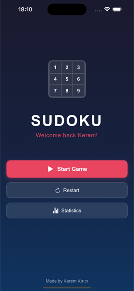
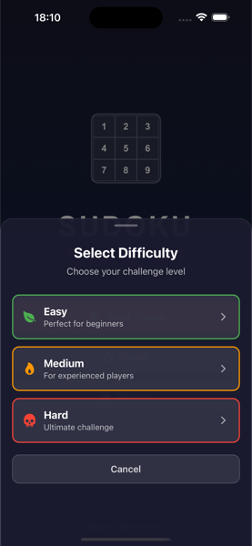

# 🧩 Sudoku - React Native App

A beautiful, feature-rich Sudoku game built with React Native and Expo. Experience the classic puzzle game with modern design, smooth animations, and intelligent gameplay features.


## ✨ Features

### 🎮 Gameplay
- **Multiple Difficulty Levels**: Easy, Medium, Hard, and Expert puzzles
- **Smart Number Input**: Tap numbers or use the number pad for quick input
- **Note Taking**: Add pencil marks to track possible numbers
- **Auto-Validation**: Real-time feedback on correct and incorrect moves
- **Undo/Redo**: Full move history with undo and redo functionality
- **Progress Tracking**: Save and resume games with elapsed time and mistake tracking

### 🎨 Design & UX
- **Dark Theme**: Beautiful dark UI with gradient backgrounds
- **Smooth Animations**: Fluid transitions and haptic feedback
- **Responsive Layout**: Optimized for all screen sizes
- **Accessibility**: High contrast colors and intuitive navigation
- **Modern UI**: Clean, minimalist design with attention to detail

### 📊 Statistics & Analytics
- **Game Statistics**: Track completion times, mistakes, and success rates
- **Progress History**: View detailed game history and performance
- **Achievement System**: Monitor your improvement over time

### 🔧 Technical Features
- **Offline Play**: No internet connection required
- **Local Storage**: Automatic game saving and restoration
- **Performance Optimized**: Smooth 60fps gameplay
- **Cross-Platform**: Works on iOS, Android, and Web

## 📱 Screenshots

### Home Page Interface


### Main Game Interface


### Statistics & Progress


### Statistics by Difficulty


## 🚀 Getting Started

### Prerequisites
- Node.js (v18 or higher)
- npm or yarn
- Expo CLI
- iOS Simulator (for iOS development)
- Android Studio (for Android development)

### Installation

1. **Clone the repository**
   ```bash
   git clone https://github.com/kerem-kirici/SudokuMobileApp.git
   cd SudokuMobileApp
   ```

2. **Install dependencies**
   ```bash
   npm install
   ```

3. **Start the development server**
   ```bash
   npx expo start
   ```

4. **Run on your preferred platform**
   - **iOS**: Press `i` in the terminal or scan the QR code with Expo Go
   - **Android**: Press `a` in the terminal or scan the QR code with Expo Go
   - **Web**: Press `w` in the terminal

## 🏗️ Project Structure

```
Sudoku/
├── app/                    # Main app screens
│   ├── _layout.tsx        # Root layout with navigation
│   ├── index.tsx          # Home screen
│   ├── game.tsx           # Main game screen
│   └── statistics.tsx     # Statistics screen
├── components/             # Reusable components
│   ├── SudokuGrid.tsx     # Sudoku grid component
│   ├── NumberPad.tsx      # Number input pad
│   └── modals.tsx         # Modal components
├── api/                   # API and data management
│   ├── PuzzleManager.ts   # Puzzle generation and management
│   ├── StatisticsManager.ts # Statistics tracking
│   └── SudokuFetchAPI.tsx # API utilities
├── types/                 # TypeScript type definitions
│   ├── sudoku.ts          # Game data types
│   └── theme.ts           # Color scheme and theming
└── assets/                # Images, fonts, and static assets
```

## 🎨 Design System

The app uses a comprehensive color scheme with semantic naming:

### Color Palette
- **Primary**: `#e94560` (Pink/Red brand color)
- **Background**: Dark blue gradient (`#1a1a2e` → `#16213e` → `#0f3460`)
- **Surface**: Semi-transparent whites for cards and modals
- **Text**: White with various opacity levels for hierarchy
- **Status Colors**: Green (success), Red (error), Orange (warning), Blue (info)

### Key Features
- **Centralized Theming**: All colors defined in `types/theme.ts`
- **Semantic Color Helpers**: Easy-to-use color access functions
- **Consistent Design**: Unified visual language across all components
- **Accessibility**: High contrast ratios for better readability

## 🧠 Game Logic

### Puzzle Generation
- **Algorithm**: Custom Sudoku puzzle generation with difficulty scaling
- **Validation**: Real-time puzzle validation and solution checking
- **Uniqueness**: Ensures each puzzle has exactly one solution

### Move System
- **Action Queue**: Prevents rapid input conflicts with sequential processing
- **History Tracking**: Complete move history with undo/redo capability
- **State Management**: Efficient state updates with React hooks

### Statistics Tracking
- **Completion Time**: Tracks elapsed time for each puzzle
- **Mistake Counting**: Records incorrect moves and attempts
- **Performance Metrics**: Calculates success rates and improvement trends

## 🛠️ Technologies Used

### Core Framework
- **React Native**: Cross-platform mobile development
- **Expo**: Development platform and tooling
- **TypeScript**: Type-safe JavaScript development

### Key Libraries
- **@react-navigation/bottom-tabs**: Tab navigation
- **@react-native-async-storage/async-storage**: Local data persistence
- **expo-haptics**: Haptic feedback for better UX
- **expo-linear-gradient**: Beautiful gradient backgrounds
- **react-native-reanimated**: Smooth animations

### Development Tools
- **ESLint**: Code linting and formatting
- **TypeScript**: Static type checking
- **Expo Router**: File-based routing system

## 🚀 Performance Optimizations

### Rendering
- **Memoization**: React.memo and useCallback for component optimization
- **Efficient Re-renders**: Minimal state updates and smart diffing
- **Lazy Loading**: Components loaded only when needed

### Memory Management
- **Action Queue**: Prevents memory leaks from rapid interactions
- **Cleanup**: Proper cleanup of event listeners and timers
- **State Optimization**: Efficient state structure and updates

### Asset Optimization
- **High-Quality Screenshots**: README images optimized to ~60-120KB each at 600px width with excellent quality
- **Fast Loading**: Optimized for quick repository browsing
- **GitHub Friendly**: Balanced file sizes for optimal performance and quality

## 📊 Features in Detail

### Game Modes
- **Classic Sudoku**: Traditional 9x9 grid puzzles
- **Difficulty Levels**: 
  - Easy: 40-50 empty cells
  - Medium: 50-60 empty cells
  - Hard: 60-70 empty cells

### Smart Features
- **Auto-Highlighting**: Highlights related cells (same row, column, box)
- **Conflict Detection**: Shows conflicts in real-time
- **Note System**: Pencil marks for tracking possibilities
- **Auto-Complete**: Automatically fills obvious cells

### User Experience
- **Haptic Feedback**: Tactile response for interactions
- **Smooth Animations**: Fluid transitions between states
- **Intuitive Controls**: Easy-to-use number input system
- **Progress Persistence**: Automatic save and restore

## 🎯 Recent Updates

### Performance Improvements
- **Action Queue System**: Prevents rapid input conflicts and missed interactions
- **High-Quality Screenshots**: Optimized README images with excellent quality and reasonable file sizes
- **Centralized Color Scheme**: Unified theming system for consistent design
- **Enhanced Modals**: Improved completion and game over modals

### Code Quality
- **TypeScript Integration**: Full type safety across the application
- **Component Refactoring**: Separated action handlers into useCallback functions
- **Error Handling**: Robust error handling and user feedback
- **Code Organization**: Clean, maintainable code structure

## 🤝 Contributing

We welcome contributions! Please feel free to submit issues and pull requests.

### Development Setup
1. Fork the repository
2. Create a feature branch (`git checkout -b feature/amazing-feature`)
3. Commit your changes (`git commit -m 'Add amazing feature'`)
4. Push to the branch (`git push origin feature/amazing-feature`)
5. Open a Pull Request

### Code Style
- Follow TypeScript best practices
- Use the existing color scheme and design patterns
- Add proper TypeScript types for new features
- Include appropriate error handling

## 📄 License

This project is licensed under the MIT License - see the [LICENSE](LICENSE) file for details.

## 🙏 Acknowledgments

- **Expo Team**: For the amazing development platform
- **React Native Community**: For the excellent ecosystem
- **Sudoku Enthusiasts**: For inspiration and feedback

## 📞 Support

If you encounter any issues or have questions:
- Open an issue on GitHub
- Check the [Expo documentation](https://docs.expo.dev/)
- Join our community discussions

---

**Made with ❤️ using React Native and Expo**

*Enjoy playing Sudoku! 🧩*
